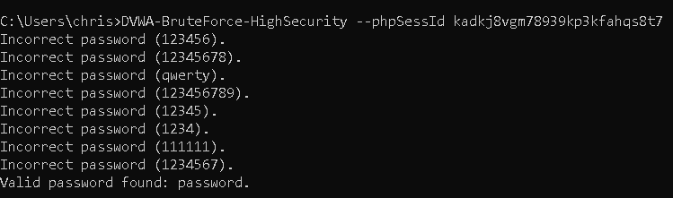
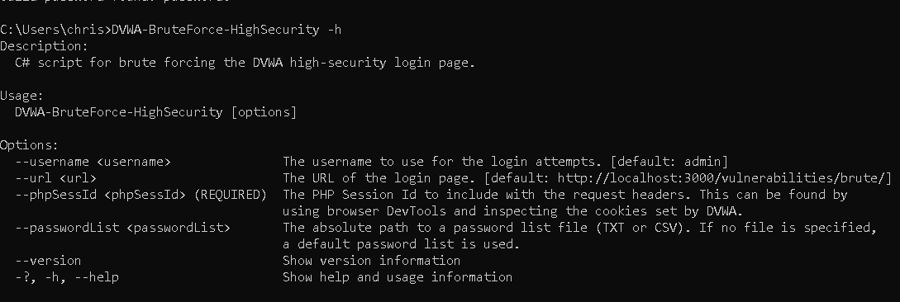

# DVWA-BruteForce-HighSecurity

This is a C# program I wrote that will automatically brute force login attempts of the high-security setting of the DVWA (Damn Vulnerable Web App) login page. The script will automatically parse for the CSRF token in the page then attempt to login until the correct password is found or the password list is exhausted. ***You can read more about DVWA and this tool in my blog post [here](https://christhegreat1.substack.com/p/writing-a-c-cli-tool-for-dvwa-login).***

To use this tool, open a command terminal, then enter the following command to download the package from nuget and install. Note that you must have .NET Core 2.1 SDK or later installed on your machine:

`dotnet tool install --global DVWA_BruteForce_HighSecurity --version 1.0.4`

Run the tool with default options with the following command:

`DVWA-BruteForce-HighSecurity --phpSessId <YOUR-SESSION-ID-COOKIE-HERE>`

View all options/help with the following command:

`DVWA-BruteForce-HighSecurity -h`

This repo also includes a CSV and TXT password list file that can be used with the optional `--passwordList` argument.

To uninstall the tool, open a command terminal and enter the following command:

`dotnet tool uninstall --global DVWA_BruteForce_HighSecurity`
